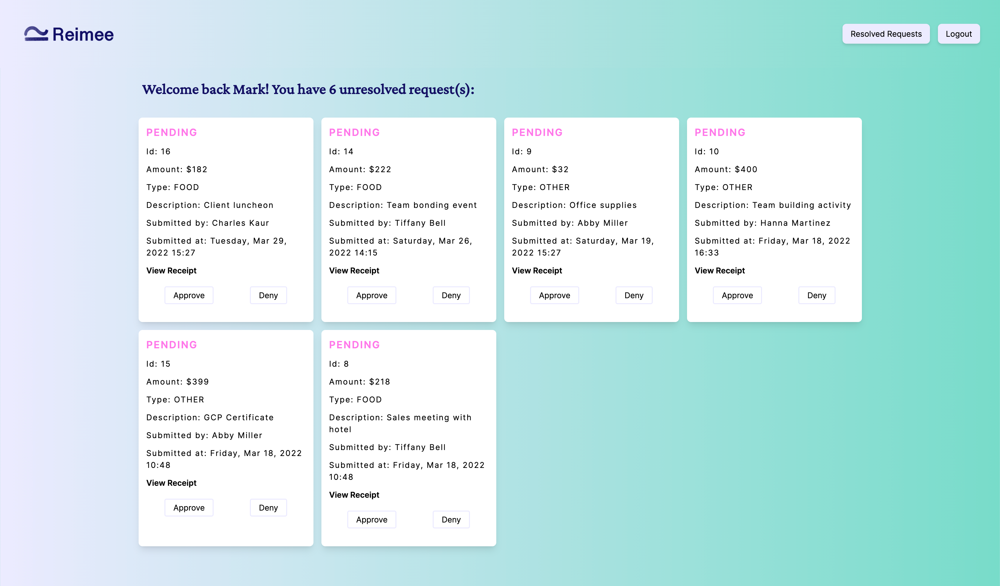
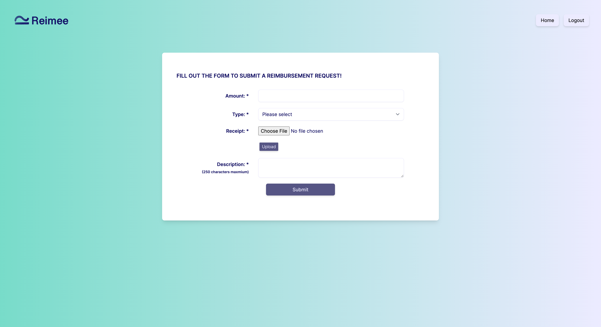

# Employee Reimbursement 

## Description
This is a full stack java application that manages the process of reimbursing employees for expenses incurred while on company time. All employees and finance managers can login or sign up to access their home page respectively. 

As an employee, I can submit requests for reimbursement along with a receipt; I can view all submitted tickets that can be filtered by the status: pending, approved and denied. 

As a fance manager, I can view all reimbursement requests and past history for all employees in the company. I can either approve or deny requests.

## Deployment

[Firebase](https://employee-reimbursement-6b730.web.app/)

## Built With

* Java 8
* Gradle
* PostgreSQL (Cloud SQL)
* Goolge Cloud Storage
* HTML
* Javascript
* Tailwind CSS
* JUnit 
* Mockito

## Testing Accounts
# Employee
username: employee111
password: pass123

# Manager
username: manager111
password: word123

## Webpage screenshots

## License

This project is licensed under the MIT License - see the [LICENSE.md](LICENSE.md) file for details

